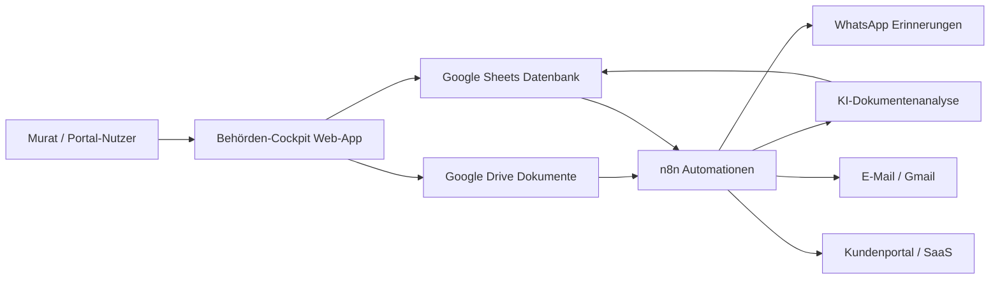

# Technische Architektur: Behörden-Cockpit

## Zielbild

Das Behörden-Cockpit verwaltet alle behördlichen und medizinischen Vorgänge zentral. Google Drive dient als Dokumentenablage, Google Sheets als leicht wartbare Datenbank und Dashboard-Quelle, n8n automatisiert Fristen, Dokumenteingänge, Erinnerungen und KI-Analysen. Eine spätere Portal- und SaaS-Erweiterung kann auf derselben Datenstruktur aufbauen.

## Kernbereiche

1. EM-Rente
2. Pflegegrad 2
3. GdB 100
4. Wohngeld
5. Kinderzuschlag
6. Krankenkasse
7. Arztberichte
8. Parkerleichterungen
9. Selbstständigkeit
10. Steuern

## Systemübersicht



## Google Drive Struktur

Jeder Hauptordner enthält dieselben Unterordner, damit Automationen zuverlässig arbeiten können:

- `01_Eingang`
- `02_In_Bearbeitung`
- `03_Antraege`
- `04_Bescheide`
- `05_Widerspruch`
- `06_Nachweise`
- `07_Archiv`

Root-Ordner:

- `01_EM-Rente`
- `02_Pflegegrad`
- `03_GdB_100`
- `04_Wohngeld`
- `05_Kinderzuschlag`
- `06_Krankenkasse`
- `07_Arztberichte`
- `08_Parkerleichterungen`
- `09_Selbstständigkeit`
- `10_Steuern`

## Google Sheets Datenmodell

Tabs:

- `Dashboard`
- `Vorgaenge`
- `Dokumente`
- `Fristen`
- `Kontakte`
- `Aufgaben`
- `KI_Analysen`
- `Automationen`
- `Portal_Nutzer`
- `Audit_Log`

Wichtige IDs:

- `vorgang_id`: eindeutige ID pro Verfahren, z. B. `EMR-2026-001`
- `dokument_id`: eindeutige ID pro Datei
- `frist_id`: eindeutige ID pro Frist
- `person_id`: später für SaaS-Mehrmandantenfähigkeit

## Zentrale Workflows in n8n

### 1. Dokumenteneingang

Trigger: Neue Datei in Google Drive `01_Eingang`

Schritte:

1. Datei-Metadaten lesen
2. OCR/Text extrahieren
3. KI-Klassifikation nach Bereich, Dokumenttyp, Behörde, Datum, Frist
4. Dateinamen nach Schema `YYYY-MM-DD_Bereich_Dokumenttyp_Murat-Kocyigit_Originalname.ext` erzeugen
5. Datei in Google Drive umbenennen
6. Datensatz in `Dokumente` schreiben
7. Vorgang aktualisieren oder neu anlegen
8. Datei in passenden Unterordner verschieben
9. optional WhatsApp-Benachrichtigung senden

### 2. Fristenüberwachung

Trigger: täglich 08:00 Uhr

Schritte:

1. Offene Fristen aus `Fristen` lesen
2. Fristen in 30, 14, 7, 3, 1 und 0 Tagen erkennen
3. Eskalationsstufe berechnen
4. WhatsApp- oder E-Mail-Erinnerung senden
5. `Audit_Log` schreiben

Importierbare Vorlage:

`n8n/workflow-fristen-whatsapp-erinnerung.json`

### 3. KI-Dokumentenanalyse

Trigger: manuell oder nach Dokumenteingang

Ausgabe:

- Zusammenfassung
- erkannte Forderungen
- erkannte Fristen
- benötigte Nachweise
- Risikoampel
- nächste Handlungsempfehlung

### 4. Kundenportal

Trigger: Portal-Aktion oder Webhook

Funktionen:

- Upload von Dokumenten
- Statusanzeige
- Aufgabenliste
- sichere Nachrichten
- Termin- und Fristenübersicht

## KI-Prompt-Strategie

Systemrolle:

> Du bist ein deutscher Behörden-Assistenzanalyst. Extrahiere Fakten aus Dokumenten, trenne sichere Informationen von Vermutungen und gib keine Rechtsberatung. Weise auf Fristen, fehlende Unterlagen und nächste sinnvolle Schritte hin.

JSON-Ausgabe:

```json
{
  "bereich": "EM-Rente",
  "dokumenttyp": "Bescheid",
  "behoerde": "DRV",
  "datum": "2026-05-31",
  "frist": "2026-06-30",
  "zusammenfassung": "...",
  "forderungen": ["..."],
  "fehlende_nachweise": ["..."],
  "risiko": "mittel",
  "naechster_schritt": "..."
}
```

## Datenschutz und Sicherheit

- Google Drive und Sheets nur mit dediziertem Google Workspace Konto nutzen
- n8n Credentials getrennt nach Produktion und Test
- rollenbasierte Zugriffe für Portal-Nutzer
- keine sensiblen Daten in Logs speichern
- Audit-Log für alle Änderungen an Fristen, Dokumenten und Status
- KI-Verarbeitung nur mit explizit freigegebenen Dokumenten
- Datenexport und Löschkonzept für spätere SaaS-Nutzung einplanen

## SaaS-Erweiterung

Für eine spätere SaaS-Version wird `person_id` oder `tenant_id` in allen Tabellen Pflicht. Google Sheets kann in der ersten Phase bleiben, sollte bei mehreren Kunden aber durch Supabase/PostgreSQL ersetzt werden.

Empfohlener Ausbau:

1. MVP: Google Sheets + Drive + n8n + lokale Web-App
2. Portal: Next.js oder vergleichbare Web-App mit Login
3. Datenbank: PostgreSQL/Supabase
4. SaaS: Mandantenfähigkeit, Abrechnung, Rollen, Audit, Backups

## MVP-Umfang

Der erste produktive MVP sollte enthalten:

- Dashboard mit Ampelstatus
- Dokumentenregister
- Fristenliste mit Eskalation
- n8n Drive-Eingangsworkflow
- tägliche Fristenprüfung
- WhatsApp-Erinnerungen
- KI-Analyse für PDF/Bild/Text
- manueller Export aus Google Sheets

## Umsetzungsreihenfolge

1. Google Drive Ordnerstruktur anlegen
2. Google Sheets Schema erstellen
3. Cockpit-App mit Demo-Daten verbinden
4. n8n Webhooks definieren
5. Drive-Dokumenteingang automatisieren
6. Fristen-Erinnerungen aktivieren
7. KI-Analyse anbinden
8. Portal und SaaS-Struktur vorbereiten
